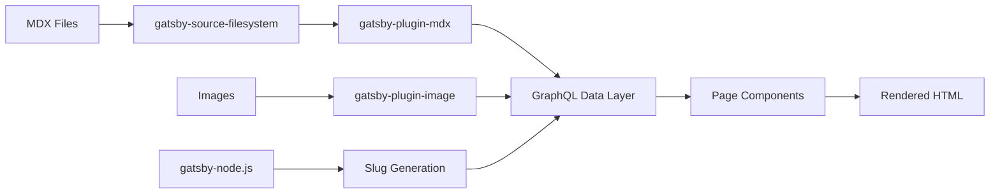
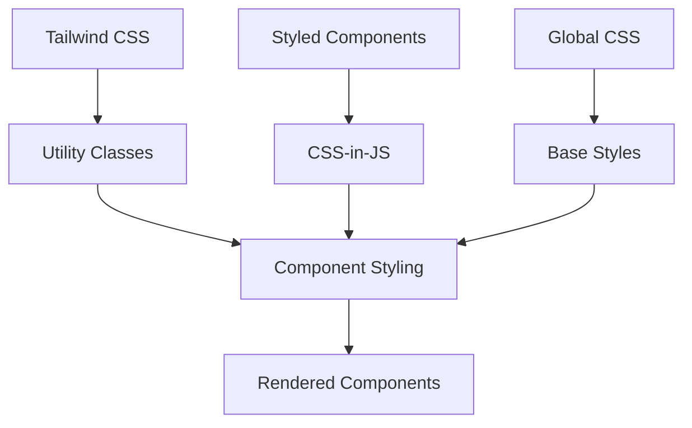

# Component Diagram

## Site Architecture Overview

```mermaid
graph TD
    A[User] --> B[Gatsby Router]
    
    B --> C[Homepage - index.js]
    B --> D[Blog Post - {mdx.fields__slug}.js]
    B --> E[Sales Pages - ai/tripwire.js]
    B --> F[Category Pages - ai-strategy.js, etc.]
    
    C --> G[Layout Component]
    D --> G
    F --> G
    
    E --> H[LayoutSales Component]
    
    G --> I[Hamburger Menu]
    G --> J[Navigation]
    G --> K[Main Content Area]
    
    H --> L[Sales Funnel Layout]
    H --> M[Footer with Logo]
    
    N[MDX Files in thoughts/] --> O[Gatsby MDX Plugin]
    O --> P[GraphQL Data Layer]
    P --> D
    P --> C
    
    Q[Images in src/images/] --> R[Gatsby Image Plugin]
    R --> C
    R --> D
    R --> E
```

## Component Relationships

### **Layout Components**
- **Layout** - Main site wrapper with navigation and branding
  - Used by: Homepage, Blog Posts, Category Pages
  - Contains: Hamburger menu, main navigation, content area
  
- **LayoutSales** - Sales funnel wrapper with "sheet of paper" design
  - Used by: Tripwire page, sales-focused pages
  - Contains: Clean layout, footer with logo

### **Page Components**
- **Homepage (index.js)** - Blog post grid with featured content
  - Data Source: GraphQL query for all MDX posts
  - Layout: Layout component
  
- **Blog Post Template ({mdx.fields__slug}.js)** - Individual post display
  - Data Source: GraphQL query for specific MDX post
  - Layout: Layout component
  - **Issue**: Missing MDX content rendering
  
- **Sales Pages (ai/tripwire.js)** - Sales funnel pages
  - Data Source: Hardcoded YAML data
  - Layout: LayoutSales component
  - **Issue**: Mockup form, not functional

### **Data Flow**



### **Content Processing Pipeline**

1. **MDX Files** in `thoughts/` directory organized by category
2. **gatsby-source-filesystem** reads files into Gatsby
3. **gatsby-plugin-mdx** processes MDX content (currently broken)
4. **gatsby-node.js** generates URL slugs from file paths
5. **GraphQL** makes processed content available to components
6. **Page Templates** render content (missing MDX body rendering)

### **Styling Architecture**



## Key Issues Identified

### **MDX Rendering Problem**
- **Location**: `src/pages/thoughts/{mdx.fields__slug}.js`
- **Issue**: Template shows placeholder instead of actual MDX content
- **Root Cause**: Missing `body` field in GraphQL query and no MDX renderer component

### **Form Functionality**
- **Location**: `src/pages/ai/tripwire.js`
- **Issue**: Buttons are mockups, no actual form submission
- **Solution**: Replace with existing serverless form component

## Working Integrations

- **Google Analytics** - Tracking configured and working
- **Hotjar** - User behavior tracking active
- **RSS Feeds** - Multiple category feeds generated automatically
- **Image Optimization** - Gatsby image processing working correctly
- **SEO** - Meta tags and structured data properly configured