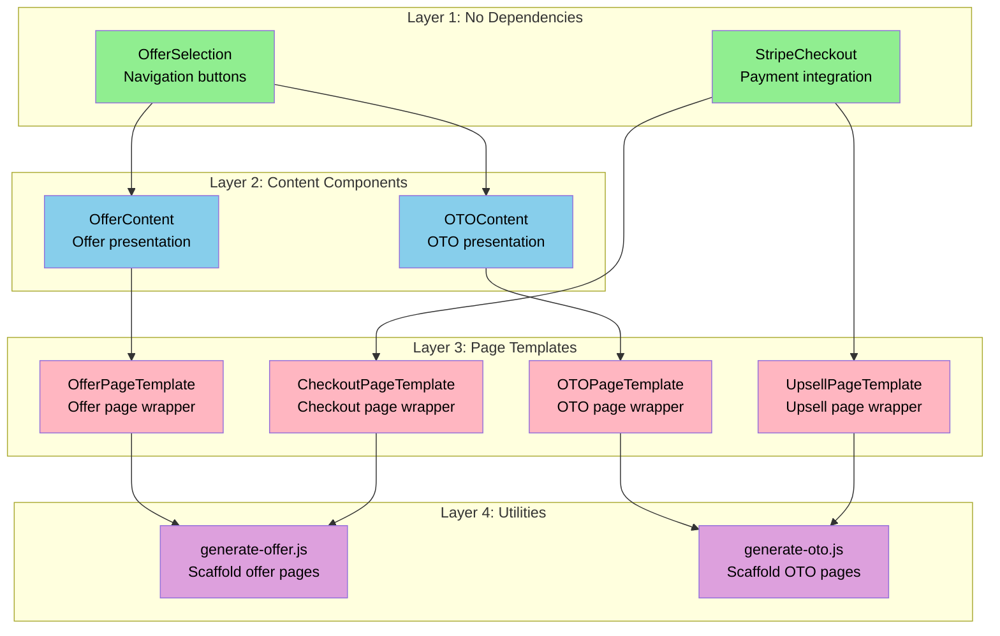

# Design Document - Phase VI: Modular Funnel Submodule Extraction

## Design Decisions

1. **Styling and Assets**: The consuming project provides all CSS styling via Tailwind classes. The submodule components use Tailwind utility classes that the consuming project must have configured.

2. **Testing in Development**: Testing will be done in the host project. No separate test environment needed.

3. **Routing and Page Components**: Page components remain in the consuming project for Gatsby routing. The submodule provides page templates that handle boilerplate, and page files become thin wrappers.

4. **Data Folder Location**: The actual data folder (`src/data/offers/`, `src/data/oto/`) remains in the consuming project. The submodule README will include example/template data files for reference.

---

## Overview

Phase VI extracts the Sales Funnel implementation into a reusable Git submodule. The goal is to move all reusable components, templates, and utilities into a standalone repository that can be added to multiple Gatsby projects via `git submodule add`. This will eliminate code duplication while preserving all existing functionality.

The extraction follows a clear separation:
- **Submodule**: Reusable components, page templates, utilities
- **Consuming Project**: Page files (for routing), data files (offer/OTO configurations), environment variables

## Architecture

### Current Architecture

```
rho-lall.github.io/
├── src/
│   ├── components/
│   │   ├── checkout/
│   │   │   └── stripe-checkout.js          # Stripe integration
│   │   ├── offer/
│   │   │   └── base.js                     # Offer presentation
│   │   ├── one-time-offer/
│   │   │   └── base.js                     # OTO presentation
│   │   └── offer-selection/
│   │       └── offer-selection.js          # Button component
│   ├── data/
│   │   ├── offers/
│   │   │   └── results-now-ai-action-pack.js
│   │   └── oto/
│   │       └── 6-month-roi-strategy-map.js
│   └── pages/
│       ├── offer/
│       │   └── results-now-ai-action-pack/
│       │       ├── index.js                # Offer page
│       │       └── checkout.js             # Checkout page
│       └── one-time-offer/
│           └── 6-month-roi-strategy-map/
│               ├── index.js                # OTO page
│               ├── checkout.js             # OTO checkout
│               └── special-bonus.js        # One-click upsell
```

### Target Architecture

```
rho-lall.github.io/
├── src/
│   ├── funnel-0ps/                         # Git submodule
│   │   ├── components/
│   │   │   ├── StripeCheckout.js
│   │   │   ├── OfferBase.js
│   │   │   ├── OTOBase.js
│   │   │   └── OfferSelection.js
│   │   ├── templates/
│   │   │   ├── OfferPageTemplate.js
│   │   │   ├── OTOPageTemplate.js
│   │   │   ├── CheckoutPageTemplate.js
│   │   │   └── UpsellPageTemplate.js
│   │   ├── scripts/
│   │   │   ├── generate-offer.js
│   │   │   └── generate-oto.js
│   │   ├── utils/
│   │   │   └── [utility functions if needed]
│   │   ├── index.js                        # Main export
│   │   └── README.md
│   ├── data/                               # Stays in consuming project
│   │   ├── offers/
│   │   └── oto/
│   └── pages/                              # Stays in consuming project
│       ├── offer/
│       │   └── results-now-ai-action-pack/
│       │       ├── index.js                # Thin wrapper
│       │       └── checkout.js             # Thin wrapper
│       └── one-time-offer/
│           └── 6-month-roi-strategy-map/
│               ├── index.js                # Thin wrapper
│               ├── checkout.js             # Thin wrapper
│               └── special-bonus.js        # Thin wrapper
```

## Components and Interfaces

### Components to Extract

#### 1. StripeCheckout Component
**Current Location**: `src/components/checkout/stripe-checkout.js`  
**New Location**: `funnel-0ps/components/StripeCheckout.js`

**Props Interface**:
```javascript
{
  priceId: string,           // Required - Stripe price ID
  successUrl: string,        // Optional - redirect after success
  cancelUrl: string,         // Optional - redirect on cancel
  isTest: boolean           // Optional - test mode flag
}
```

**Dependencies**:
- `@stripe/stripe-js`
- `react`

**Environment Variables Used**:
- `GATSBY_STRIPE_PUBLISHABLE_KEY_TEST`
- `GATSBY_STRIPE_PUBLISHABLE_KEY_PROD`

#### 2. OfferContent Component
**Current Location**: `src/components/offer/base.js`  
**New Location**: `funnel-0ps/components/OfferContent.js`

**Props Interface**:
```javascript
{
  offerData: object,         // Required - offer configuration
  productImage: ReactNode,   // Optional - product image
  children: ReactNode,       // Required - button components
  progressText: string,      // Optional - progress bar text
  timerMinutes: number      // Optional - countdown duration
}
```

**Dependencies**:
- `react`
- `react-markdown`
- `gatsby-plugin-image` (for StaticImage in consuming project)

#### 3. OTOContent Component
**Current Location**: `src/components/one-time-offer/base.js`  
**New Location**: `funnel-0ps/components/OTOContent.js`

**Props Interface**:
```javascript
{
  offerData: object,         // Required - OTO configuration
  productImage: ReactNode,   // Optional - product image
  children: ReactNode,       // Required - button components
  progressText: string,      // Optional - progress bar text
  timerMinutes: number      // Optional - countdown duration
}
```

**Dependencies**:
- `react`
- `react-markdown`

#### 4. OfferSelection Component
**Current Location**: `src/components/offer-selection/offer-selection.js`  
**New Location**: `funnel-0ps/components/OfferSelection.js`

**Props Interface**:
```javascript
{
  checkoutUrl: string,       // Required - checkout URL
  declineUrl: string,        // Required - decline URL
  primaryText: string,       // Optional - primary button text
  secondaryText: string     // Optional - secondary button text
}
```

**Dependencies**:
- `react`
- `gatsby` (for navigate function)

### Page Templates to Create

#### 1. OfferPageTemplate
**New Component**: `funnel-0ps/templates/OfferPageTemplate.js`

Handles all boilerplate for offer pages including:
- Layout wrapper
- Helmet/SEO configuration
- Test mode banner
- OfferContent component integration
- OfferSelection component integration

**Props Interface**:
```javascript
{
  offerData: object,         // Required - offer configuration
  checkoutUrl: string,       // Required - checkout URL
  declineUrl: string,        // Required - decline URL
  productImagePath: string  // Optional - path to product image
}
```

#### 2. OTOPageTemplate
**New Component**: `funnel-0ps/templates/OTOPageTemplate.js`

Similar to OfferPageTemplate but for OTO pages.

#### 3. CheckoutPageTemplate
**New Component**: `funnel-0ps/templates/CheckoutPageTemplate.js`

Handles checkout page boilerplate including:
- Layout wrapper
- Helmet/SEO configuration
- Test mode banner
- StripeCheckout component integration

**Props Interface**:
```javascript
{
  offerData: object,         // Required - offer configuration
  successUrl: string,        // Optional - success redirect
  cancelUrl: string         // Optional - cancel redirect
}
```

#### 4. UpsellPageTemplate
**New Component**: `funnel-0ps/templates/UpsellPageTemplate.js`

Handles one-click upsell page boilerplate.

## Data Models

### Offer Data Structure

The offer data files remain in the consuming project at `src/data/offers/`. The structure is:

```javascript
export const offerData = {
  // Stripe Configuration
  stripe: {
    test_priceId: string,    // Test mode price ID
    price_id: string         // Live mode price ID
  },
  
  // Meta Information (SEO)
  meta: {
    title: string,
    description: string,
    keywords: string,
    author: string
  },
  
  // Pre-Hero Section
  pre_hero_section: {
    text_above_progress: string,
    progress_bar: {
      width: string,         // e.g., '60%'
      gradient: string,      // CSS gradient
      text: string
    },
    text_below_progress: string
  },
  
  // Hero Section
  hero_section: {
    headline: string,
    sub_headline: string,
    offer_price: string
  },
  
  // Product Section
  product_section: {
    copy: string            // Markdown supported
  },
  
  // Offer Section
  offer_section: {
    headline: string,
    sub_headline: string
  },
  
  // CTA Section
  cta_section: {
    headline: string
  },
  
  // Button Text
  buttons: {
    primary_text: string,
    secondary_text: string
  },
  
  // Visual Styling
  colors: {
    accent_color: string,
    background_dark: string,
    price_color: string,
    value_color: string
  },
  
  // Timer Configuration
  show_timer: boolean,
  timer_minutes: number
}
```

### OTO Data Structure

Similar to offer data structure, with same properties. Remains in consuming project at `src/data/oto/`.

## Styling Approach

### Tailwind CSS Dependency

The submodule components use Tailwind CSS utility classes for styling. The consuming project must:

1. Have Tailwind CSS installed and configured
2. Include Tailwind in its build process
3. Have the standard Tailwind configuration (colors, spacing, etc.)

### No CSS Files in Submodule

The submodule will NOT include:
- CSS files
- CSS modules
- Styled-components definitions

All styling is done via Tailwind utility classes directly in the JSX.

### Consuming Project Responsibilities

The consuming project provides:
- Tailwind CSS configuration
- Global styles (if any)
- Layout components (e.g., `LayoutSales`)
- Theme customization

## Environment Configuration

### Required Environment Variables

The consuming project must define these in its root `.env` file:

```bash
# Test/Live Mode Toggle
ISTEST=true                                    # or 'false' for live mode

# Stripe Keys
GATSBY_STRIPE_PUBLISHABLE_KEY_TEST=pk_test_... # Test publishable key
GATSBY_STRIPE_PUBLISHABLE_KEY_PROD=pk_live_... # Live publishable key
```

### How Configuration Works

1. The submodule components read environment variables directly via `process.env`
2. During Gatsby build, environment variables from the consuming project's `.env` are available to all code
3. The submodule determines test/live mode by reading `process.env.ISTEST`
4. No props needed - the submodule handles it internally

## Component Dependency Diagram



**Extraction Order:**
1. **Green (Layer 1)**: Independent components - extract first
2. **Blue (Layer 2)**: Content components - depend on Layer 1
3. **Pink (Layer 3)**: Templates - depend on Layers 1 & 2
4. **Purple (Layer 4)**: Scripts - depend on Layer 3 templates

## Migration Strategy

### Phase 1: Create Submodule Repository

1. Create new GitHub repository (e.g., `gatsby-funnel-submodule`)
2. Initialize with README and directory structure
3. Set up .gitignore

### Phase 2: Extract Components

Move components one at a time:

1. Copy component file to submodule
2. Update imports in submodule
3. Test component in isolation
4. Commit to submodule repo

Order:
1. OfferSelection (no dependencies on other funnel components)
2. StripeCheckout (no dependencies on other funnel components)
3. OfferContent (depends on OfferSelection)
4. OTOContent (depends on OfferSelection)

### Phase 3: Create Page Templates

Build new template components in submodule:

1. OfferPageTemplate
2. CheckoutPageTemplate
3. OTOPageTemplate
4. UpsellPageTemplate

### Phase 4: Add Submodule to Host Project

1. Run `git submodule add <repo-url> src/funnel-0ps`
2. Commit .gitmodules file

### Phase 5: Update Host Project Pages

Update page files one at a time to use submodule templates:

1. Update imports
2. Simplify page component to thin wrapper
3. Test functionality
4. Commit changes

### Phase 6: Clean Up

1. Remove original component files from host project
2. Update any remaining references
3. Final testing

## Correctness Properties

*A property is a characteristic or behavior that should hold true across all valid executions of a system-essentially, a formal statement about what the system should do. Properties serve as the bridge between human-readable specifications and machine-verifiable correctness guarantees.*

### Property 1: Component Extraction Preserves Functionality

*For any* funnel page, after migrating to use submodule components, the page should function identically to the pre-migration state.

**Validates: Requirements 7.5, 9.2, 9.3, 9.4, 9.5**

### Property 2: Environment Variable Access

*For any* submodule component that reads environment variables, the component should successfully read values from the consuming project's environment.

**Validates: Requirements 6.1, 6.2, 6.3, 6.4**

### Property 3: Import Path Consistency

*For any* page file in the consuming project, all imports from the submodule should use consistent relative paths from the submodule location.

**Validates: Requirements 7.2**

## Error Handling

### Missing Environment Variables

Submodule components should validate required environment variables and provide clear error messages:

```javascript
if (!process.env.GATSBY_STRIPE_PUBLISHABLE_KEY_TEST || !process.env.GATSBY_STRIPE_PUBLISHABLE_KEY_PROD) {
  throw new Error('Missing required Stripe keys. Please set GATSBY_STRIPE_PUBLISHABLE_KEY_TEST and GATSBY_STRIPE_PUBLISHABLE_KEY_PROD in your .env file.')
}
```

### Missing Required Props

Template components should validate required props:

```javascript
if (!offerData) {
  throw new Error('OfferPageTemplate requires offerData prop')
}
```

## Testing Strategy

### Manual Testing

Since this is a refactoring project, testing will be manual:

1. **Build Test**: Verify the host project builds successfully after each migration step
2. **Visual Test**: Verify pages render identically to pre-migration
3. **Functional Test**: Complete full funnel flow in test mode:
   - View offer page
   - Proceed to checkout
   - Complete test purchase
   - View OTO page
   - Complete one-click upsell
4. **Environment Test**: Verify test mode banner displays correctly
5. **Navigation Test**: Verify all buttons and links work correctly

### Testing Approach

- Test after each component extraction
- Test after each page migration
- Final end-to-end test after complete migration
- No automated tests for this phase (refactoring only)
