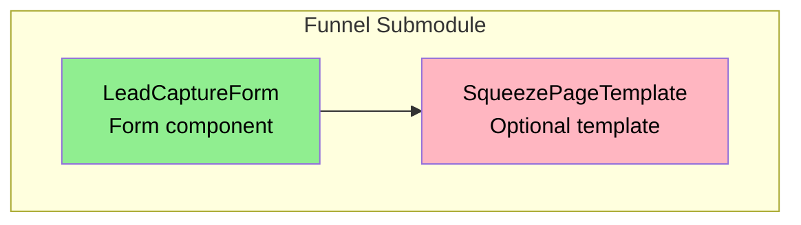

# Design Document - Phase VII: Lead Capture Extraction & Host Project Cleanup

## Overview

Phase VII extracts the lead capture functionality into the funnel-0ps submodule and removes all AI-specific pages from the host project. This completes the modularization effort by ensuring all reusable funnel components are in the submodule, while the host project is cleaned up of AI-specific content that will be built in separate repositories.

The phase has two main objectives:
1. **Extract Lead Capture**: Move the LeadCaptureForm component to the submodule and create a reusable SqueezePageTemplate
2. **Clean Up Host Project**: Remove AI squeeze page, AI offer pages, and AI OTO pages that will be built in separate repositories

## Architecture

### Current State

```
rho-lall.github.io/
├── src/
│   ├── components/
│   │   └── lead-capture/
│   │       └── lead-capture.js          # To be extracted
│   ├── pages/
│   │   ├── ai/
│   │   │   └── index.js                 # Uses local lead-capture
│   │   ├── offer/
│   │   │   └── results-now-ai-action-pack/  # To be removed
│   │   │       ├── index.js
│   │   │       └── checkout.js
│   │   └── one-time-offer/
│   │       └── 6-month-roi-strategy-map/    # To be removed
│   │           ├── index.js
│   │           ├── checkout.js
│   │           └── special-bonus.js
│   └── funnel-0ps/                      # Git submodule
│       ├── components/
│       │   ├── OfferContent.js
│       │   ├── OTOContent.js
│       │   ├── OfferSelection.js
│       │   └── StripeCheckout.js
│       └── templates/
│           ├── OfferPageTemplate.js
│           ├── OTOPageTemplate.js
│           ├── CheckoutPageTemplate.js
│           └── UpsellPageTemplate.js
```

### Target State

```
rho-lall.github.io/
├── src/
│   ├── pages/
│   │   └── [other pages remain]
│   └── funnel-0ps/                      # Git submodule
│       ├── components/
│       │   ├── OfferContent.js
│       │   ├── OTOContent.js
│       │   ├── OfferSelection.js
│       │   ├── StripeCheckout.js
│       │   └── LeadCaptureForm.js       # NEW - Extracted
│       └── templates/
│           ├── OfferPageTemplate.js
│           ├── OTOPageTemplate.js
│           ├── CheckoutPageTemplate.js
│           ├── UpsellPageTemplate.js
│           └── SqueezePageTemplate.js   # NEW - Created
```

**Removed from Host Project**:
- `src/pages/ai/` directory (AI squeeze page)
- `src/pages/offer/results-now-ai-action-pack/` directory (AI offer pages)
- `src/pages/one-time-offer/6-month-roi-strategy-map/` directory (AI OTO pages)
- `src/components/lead-capture/` directory (local lead capture component)

## Components and Interfaces

### 1. LeadCaptureForm Component

**Location**: `funnel-0ps/components/LeadCaptureForm.js`

**Props Interface**:
```javascript
{
  apiEndpoint: string,        // Required - Backend API URL for form submission
  buttonText: string,         // Optional - Button text (default: "Become AI emPowered")
  successUrl: string,         // Optional - URL to navigate to after successful submission
  onSuccess: function,        // Optional - Callback function after successful submission
  onError: function          // Optional - Callback function on submission error
}
```

**Functionality**:
- Collects name, email, and details fields
- Validates required fields (name and email)
- Submits form data to the provided API endpoint
- Displays error messages for failed submissions
- Navigates to successUrl after successful submission (if provided)
- Calls onSuccess callback after successful submission (if provided)
- Uses Tailwind CSS for styling

**Dependencies**:
- `react` (useState)
- `gatsby` (navigate function)

**State Management**:
```javascript
{
  formData: {
    name: string,
    email: string,
    details: string
  },
  isSubmitting: boolean,
  message: string  // Error message
}
```

### 2. SqueezePageTemplate Component

**Location**: `funnel-0ps/templates/SqueezePageTemplate.js`

**Props Interface**:
```javascript
{
  pageData: {
    meta: {
      title: string,
      description: string,
      keywords: string,
      author: string
    }
  },
  apiEndpoint: string,        // Required - API endpoint for lead capture
  successUrl: string,         // Optional - Post-submission redirect URL
  buttonText: string,         // Optional - Form button text
  children: ReactNode         // Optional - Custom content sections
}
```

**Functionality**:
- Provides Layout wrapper integration
- Handles Helmet/SEO configuration
- Integrates LeadCaptureForm component
- Supports custom content via children prop
- Minimal boilerplate for squeeze pages

**Dependencies**:
- `react`
- `react-helmet`
- `LeadCaptureForm` component
- Layout component from consuming project

## Data Models

### Lead Capture Form Data

```javascript
{
  name: string,              // Required - First name (2-50 characters)
  email: string,             // Required - Valid email address
  details: string,           // Optional - Additional details (max 500 characters)
  customFields: {
    source: string,          // Auto-populated: 'react-form'
    timestamp: string        // Auto-populated: ISO timestamp
  }
}
```

### API Request Format

```javascript
POST {apiEndpoint}
Content-Type: application/json

{
  "name": "John",
  "email": "john@example.com",
  "details": "Looking for AI strategy help",
  "customFields": {
    "source": "react-form",
    "timestamp": "2025-01-15T10:30:00.000Z"
  }
}
```

### API Response Format

**Success Response**:
```javascript
{
  "success": true,
  "message": "Lead captured successfully",
  "leadId": "uuid-string"
}
```

**Error Response**:
```javascript
{
  "success": false,
  "error": {
    "message": "Error description"
  }
}
```

## Migration Strategy

### Phase 1: Extract LeadCaptureForm to Submodule

1. Copy `src/components/lead-capture/lead-capture.js` to `funnel-0ps/components/LeadCaptureForm.js`
2. Update component to accept successUrl prop
3. Add onSuccess and onError callback props
4. Update imports within the component
5. Export from `funnel-0ps/index.js`
6. Commit to submodule repository

### Phase 2: Create SqueezePageTemplate (Optional)

1. Create `funnel-0ps/templates/SqueezePageTemplate.js`
2. Implement basic template structure
3. Integrate LeadCaptureForm
4. Export from `funnel-0ps/index.js`
5. Commit to submodule repository

**Note**: This template is optional for Phase VII since the AI page has custom layout. It's included for future squeeze pages.

### Phase 3: Remove AI Squeeze Page

1. Delete `src/pages/ai/` directory
2. Verify no broken imports or links
3. Test build
4. Commit changes

### Phase 4: Remove AI Offer Pages

1. Delete `src/pages/offer/results-now-ai-action-pack/` directory
2. Verify no broken imports or links
3. Test build
4. Commit changes

### Phase 5: Remove AI OTO Pages

1. Delete `src/pages/one-time-offer/6-month-roi-strategy-map/` directory
2. Verify no broken imports or links
3. Test build
4. Commit changes

### Phase 6: Clean Up Local Lead Capture Component

1. Delete `src/components/lead-capture/` directory
2. Verify no remaining references to local lead-capture component
3. Final build test
4. Update submodule README with LeadCaptureForm documentation

## Component Dependency Diagram



**Extraction Order**:
1. **Green**: LeadCaptureForm - extract first (no dependencies)
2. **Pink**: SqueezePageTemplate - optional, depends on LeadCaptureForm

## Correctness Properties

*A property is a characteristic or behavior that should hold true across all valid executions of a system-essentially, a formal statement about what the system should do. Properties serve as the bridge between human-readable specifications and machine-verifiable correctness guarantees.*

### Acceptance Criteria Testing Prework

1.1 THE Funnel Submodule SHALL include a LeadCaptureForm component
  Thoughts: This is a structural requirement about what files exist in the submodule. We can verify the file exists and exports the component.
  Testable: yes - example

1.2 THE LeadCaptureForm SHALL accept an apiEndpoint prop for form submissions
  Thoughts: This is testing that the component accepts a specific prop and uses it correctly. We can test this by passing different endpoints and verifying they're used in the fetch call.
  Testable: yes - property

1.3 THE LeadCaptureForm SHALL accept a buttonText prop with a default value
  Thoughts: This tests that the prop is accepted and has a default. We can test with and without the prop.
  Testable: yes - property

1.4 THE LeadCaptureForm SHALL accept a successUrl prop for post-submission navigation
  Thoughts: This tests that the component accepts the prop and uses it for navigation after submission.
  Testable: yes - property

1.5 THE LeadCaptureForm SHALL collect name, email, and details fields
  Thoughts: This tests that the form has the correct input fields and collects their values.
  Testable: yes - example

1.6 THE LeadCaptureForm SHALL validate required fields before submission
  Thoughts: This is about validation behavior across all inputs. We can test with various invalid inputs (empty name, invalid email, etc.) and ensure submission is prevented.
  Testable: yes - property

1.7 THE LeadCaptureForm SHALL display error messages for failed submissions
  Thoughts: This tests that when the API returns an error, the component displays an error message.
  Testable: yes - property

1.8 THE LeadCaptureForm SHALL navigate to the successUrl after successful submission
  Thoughts: This tests that after a successful API response, navigation occurs to the provided URL.
  Testable: yes - property

3.1 THE Host Project SHALL remove the file `src/pages/ai/index.js`
  Thoughts: This is a structural requirement about file system state. We can verify the file doesn't exist.
  Testable: yes - example

3.2 THE Host Project SHALL successfully build after removing the AI page
  Thoughts: This tests that the build process completes without errors.
  Testable: yes - example

4.1 THE Host Project SHALL remove the directory `src/pages/offer/results-now-ai-action-pack/`
  Thoughts: This is a structural requirement about file system state. We can verify the directory doesn't exist.
  Testable: yes - example

4.3 THE Host Project SHALL successfully build after removing the offer pages
  Thoughts: This tests that the build process completes without errors.
  Testable: yes - example

5.1 THE Host Project SHALL remove the directory `src/pages/one-time-offer/6-month-roi-strategy-map/`
  Thoughts: This is a structural requirement about file system state. We can verify the directory doesn't exist.
  Testable: yes - example

5.3 THE Host Project SHALL successfully build after removing the OTO pages
  Thoughts: This tests that the build process completes without errors.
  Testable: yes - example

### Property Reflection

After reviewing the prework, I identify the following redundancies:
- Properties 3.2, 4.3, and 5.3 all test that the build succeeds after deletions. These can be combined into a single property that tests the build after all deletions are complete.

### Correctness Properties

Property 1: Form field validation prevents invalid submissions
*For any* form submission attempt with invalid data (empty required fields, invalid email format), the form should prevent submission and not call the API endpoint.
**Validates: Requirements 1.6**

Property 2: API endpoint configuration
*For any* valid API endpoint URL passed as a prop, the LeadCaptureForm should use that exact URL when making the POST request.
**Validates: Requirements 1.2**

Property 3: Success navigation behavior
*For any* successful form submission with a successUrl provided, the component should navigate to that URL after receiving a successful API response.
**Validates: Requirements 1.4, 1.8**

Property 4: Error message display
*For any* failed API submission, the component should display an error message to the user.
**Validates: Requirements 1.7**

Property 5: Button text customization
*For any* buttonText prop value provided, the submit button should display that text; when no buttonText is provided, it should display the default text.
**Validates: Requirements 1.3**


## Error Handling

### Form Validation Errors

The LeadCaptureForm should validate:
- **Name**: Required, 2-50 characters
- **Email**: Required, valid email format
- **Details**: Optional, max 500 characters

Validation is handled by HTML5 form validation attributes.

### API Submission Errors

```javascript
try {
  const response = await fetch(apiEndpoint, { /* ... */ });
  
  if (!response.ok) {
    const errorData = await response.json();
    throw new Error(errorData.error?.message || 'Submission failed');
  }
  
  // Success handling
} catch (error) {
  setMessage('Something went wrong. Please try again.');
  console.error('Error:', error);
}
```

### Network Errors

Network errors (no connection, timeout) are caught and displayed as generic error messages to avoid exposing technical details to users.

## Testing Strategy

### Manual Testing

Since this is primarily an extraction and cleanup phase, testing will be manual:

1. **Component Extraction Test**:
   - Verify LeadCaptureForm exists in submodule
   - Verify component exports correctly from submodule index.js
   - Verify component can be imported in test scenarios

2. **Build Test**:
   - Build host project after each deletion
   - Verify no build errors
   - Verify no broken imports or references

3. **Documentation Test**:
   - Verify submodule README includes LeadCaptureForm documentation
   - Verify all props are documented
   - Verify usage examples are clear

### Testing Approach

- Test after extracting LeadCaptureForm to submodule
- Test after each deletion (AI page, offer pages, OTO pages, local component)
- Final build test after all deletions complete

## Documentation Updates

### Submodule README Updates

Add section for Lead Capture:

```markdown
## Lead Capture Components

### LeadCaptureForm

A reusable form component for capturing leads.

**Props**:
- `apiEndpoint` (string, required): Backend API URL for form submission
- `buttonText` (string, optional): Button text (default: "Become AI emPowered")
- `successUrl` (string, optional): URL to navigate to after successful submission
- `onSuccess` (function, optional): Callback after successful submission
- `onError` (function, optional): Callback on submission error

**Example**:
```javascript
import { LeadCaptureForm } from '../funnel-0ps'

<LeadCaptureForm
  apiEndpoint="https://api.example.com/leads"
  successUrl="/offer/my-offer/"
  buttonText="Get Started"
/>
```

**API Requirements**:
- Endpoint must accept POST requests
- Content-Type: application/json
- Expected request body: { name, email, details, customFields }
- Expected success response: { success: true }
- Expected error response: { success: false, error: { message: string } }
```

## Success Criteria

Phase VII will be considered complete when:
1. ✅ LeadCaptureForm component exists in funnel-0ps/components/
2. ✅ SqueezePageTemplate exists in funnel-0ps/templates/ (optional)
3. ✅ AI squeeze page is removed from host project
4. ✅ AI offer pages are removed from host project
5. ✅ AI OTO pages are removed from host project
6. ✅ Local lead-capture component directory is removed from host project
7. ✅ Host project builds successfully
8. ✅ Submodule README is updated with lead capture documentation
