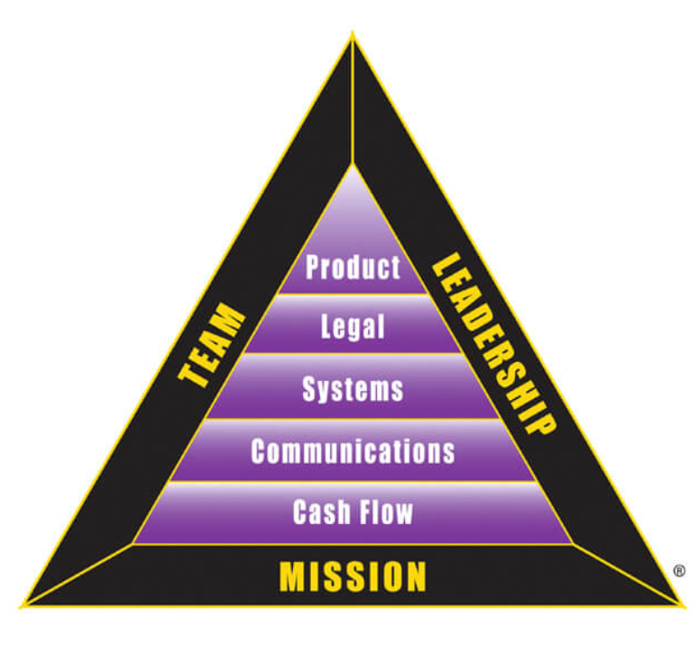

There are many people with great ideas, but few people with great fortune.  The BI Triangle has the power to turn ordinary ideas into great fortune.   

## Questions to ask:   

- How is it that you have so many businesses and other people can barely handle one?
- How does your business grow while other people stay small?
- How do you have free-time when other business owners work constantly?
- Why do so many businesses start and then fail so quickly?

## why build a business?

**Excessive cash flow.** In his book How To Be Rich, J. Paul Getty states that his first rule is that you must be in business for yourself. 
This allows them the free time and extra money to keep investing in more and more assets, more assets tax free.

**Sell it.** For someone to be valuable, for something to be valuable, there must be many more people than you who want it.
If you can build a successful business, you will always have a lot money.
If you learn to build a successful business, you will have developed a profession that few people ever achieve. 
As a business owner, you only need to get it right . .. once.

**To build a business and take it public.** This was RD's idea of becoming an ultimate investment.

You're never too old and you're never too young.

The BI triangle outlines primary technical skills that are required as

- Vision: The ability to see what others cannot see. 
- Courage: The ability to act despite tremendous doubt.
- Creativity: The ability to think outside the box.
- The ability to withstand criticism: There is not one successful person who has not been criticized. 
- The ability to delay gratification: to be very disciplined, to learn to deny short-term and immediate self gratification in favor of a greater long-term reward.

## Mission:

A business can have both a spiritual and a business mission to be successful, especially at the beginning. 
If the mission is clear and strong, the business will weather the trials every business goes through during its first 10 years.  
When a business gets big and it forgets its mission, or the mission it was created for is no longer needed, the business begins to die.

Many people start a business only to make money... 
The mission of a business should fill a need the customer wants. If fulfills that need well, the business will begin to make money.
When a spiritual mission and business mission are both strong and in mind, the combined power builds.
A mission must be preserved long after the entrepreneur is gone, or the business dies.

## Team

Many entrepreneurs, they'll really become business people, until after they leave their first business. Experience is a better teacher.
One of the first things to look at when evaluating a business, such as looking at a business to invest in or to buy stocks in, is the team running it.
One of the biggest problems businesses have is they personally lack experience and they have no team behind them, a team that inspires confidence.
For example, a business looking to go public should have someone on the team that has experience taking business public.  
Looking at a business plan, one of the lines you should check is the line item under salary.
A high salary reveals an entrepreneur is not interested in creating a business but more creating jobs and lining their wallet.  
As an investor, you should invest in management.  Not an idea.  You want to look for management team that has experience, passion and commitment.   

One of the reasons for creating CashFlow the board game is so you can learn to operate as a member of a team and as an individual.  
Another thing to note, "money follows management".  

Business is a team sport. Investing is a team sport.
In school, they train students to take tests on their own. If a child attempts to cooperate at that time, it's called cheating. 
Rich dad would also say, in the real world, that there's not business owners cooperate at that time, and in the world of business, every day is test time.

Important lesson: People in the E and S quadrant often make less money they could or would like to, because they attempt to do things on their own. 
Especially those in the E quadrant, they form a union, instead of a team. 
There's a perfect example of an individual trying to trade against the well organized team.

The people who want to become sophisticated investors and above must invest as a team.  
On Rich Dad's team, we are accountant attorneys, brokers, financial advisors, insurance agents, and bankers.
When I was first starting out, I dreamed of having my own team of accountants and attorneys, not a boat.
My CPA was minding about 30 other businesses on that day alone.
In comparison, I could see a team of people working only on Rich Dad's business. 
In the working areas, his office was a row of bookkeepers, about 14 of them. 
Five full time accountants, chief financial officer. He also had two full time attorneys working for him in his main office.

As I said, most people work hard, and dream of getting away on their boat. 
I first dreamed of having a team of full time accountant and attorneys. 
That is why I could now have a big boat, and the free time. A matter of priority.

#### Natural Tetrahedron

A team forms a natural tetrahedron. A natural tetrahedron has the nature comprised of air, fire, earth, and rain.  
Each person tends to be weighted predominantly in one of these elements, although we all have some part of each of the four.  
If you only put two elements together, as in a partnership, you get some strange phenomena:

- Air and water equal spray.
- Air and earth equal dust.
- Water and earth equal mud.
- Earth and fire equal lava and/or ash.
- Fire and water equal steam.
- Fire and air equal flame.

People came and went until the right tetra-team finally locked into place.  Once this stabilized, it begins to radiate out, growing rapidly and with stability.   

## Leadership

Troops do not follow a leader who does not lead.
The most important quality of a leader is trust.
A leader's job is to bring out the best in people, not to be the best person.
If you are the smartest person on your business team, your business is in trouble.
Volunteer more... at your Church, take on projects.  At work, volunteer to lead projects.
A Leader's roles are a combination of:

- Visionary.
- Cheerleader.
- Pit boss.

As a visionary, the leader must keep his or her focus on the corporate mission.  
As a cheerleader, he or she must inspire the team as they work together toward that mission, as well as herald success along the way.   
Pit boss, he or she must be able to make tough calls regarding issues that distract the team from achieving the mission, 
to take effective action while maintaining focus.   
With the right mission and team, you are well on your way to building a strong business.
