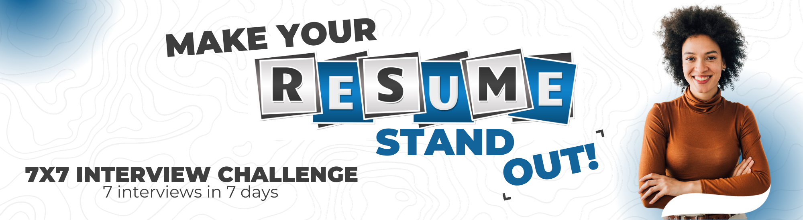

Welcome to the 7x7 Interview Challenge. The next cohort is in January. You can sign up [here](https://7x7interviewchallenge.assumewisely.com). I'm going to take you step by step through a process that is going to line up interviews.

Are you actively looking for their first data science role right now?

If you've failed at interviewing, it's not your fault. There's a lot of information out there, and it's confusing.

Information overload is real and it will keep you from success.

It's ok. 

If you've been concerned that you just can't succeed in data science, I want to put those fears to rest. You can do this. You just need the right guidance.

 

There are huge industries that profit off you thinking that you need

- some fancy degree,
- or to attend the right schools,
- to shackle yourself with debt,
- or know the right people to be successful.

I'm telling you that isn't the whole story. They have their reasons for wanting you to think that, but it's just not true. If you've ever thought that job applications and the hiring process are set up to weed you out, you're not wrong.  I'm here today because I care about your success. This is course I wish I had when I was getting started. That is what we are here for. I know you have aspirations
- to change the world for your family
- to make an impact. 

I want to show you how to make that happen.

## The Measuring Stick

When we finish here, you will judge me. Some of you may judge me harshly simply because you have different goals than I do. I don't want you leave you wondering, is this for me?

My goal for this presentation is to help four types of people:

- recent college grads & boot-campers
- experienced data people (DBAs, data engineers, data analysts)
- parents returning to work
- and candidates with diverse backgrounds

For those with little to no experience, I'm helping you to break into the space. This course was designed with you in mind.

For more experienced job seekers, DBAs, data engineers, etc. When I first developed this course it was with recent college grads and candidates with little to no experience in mind. But, I'm meeting solid candidates with a wealth of experience who are having trouble translating that experience into the next stage of their career. I got you too.

## Interview Hacking

My goal is to get you to believe that interview hacking is the first domino of a series. When you master this, everything else will fall into place. You will get your first data science role, and every role after.

 ”hacking” isn't just for coders. In fact, the simple mindset of a hacker can help you reboot your career and reach your potential without wasting more time.

Good?

If you're ready, Say I'm ready. And [click here](https://7x7interviewchallenge.assumewisely.com) to get started.

