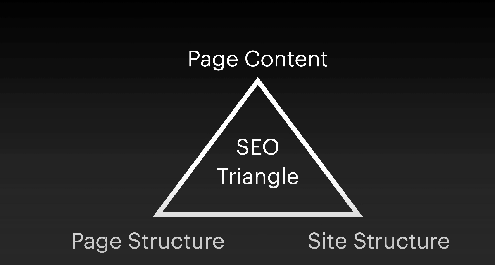

Today we're talking about SEO or search engine optimization. In terms of SEO There are three big areas of focus. 
The first is page content.  How SEO relates to the content on each individual page of your website.
The second section i'm going to focus on is page structure. How the page is built.
The third section i'm going to focus on is site structure.
I'll focus on all three characteristics as part of this SEO triangle.

 

Google actually publishes a [handy search engine optimization or SEO starter guide](https://developers.google.com/search/docs/beginner/seo-starter-guide)
 through the google search central. We're going to go through this and go over the various pieces of how a site should be built
and optimized. I will also touch on the technology I use to publish search engine optimized content.

`I build using Gatsby a react framework. For SEO i use Helmet. The react helmet allows me to build SEO
into my content programatically, saving me from having to do it all manually.`

## How can i structure content? The first piece the SEO triangle.

You'll notice up at the top of the browser the tab has a page title. The left side is the specific name of the page and the right side is the name of the
site. This is best practice SEO strategy. Helmet allows me to do this programatically. This is big.
If I reference Google Search Central in the SEO Guide it says, 

- Create unique accurate page titles.

The title tag inside the head is where you're going to find the title of the page. Google goes on to say,

- Create good titles and snippets in search results.
- The best practice is to choose a title that reads naturally and effectively that communicates the topic of the page's content.
- avoid single title across all your pages or large groups

What you don't want to do is list each page with the same title. With these tools I can do this at scale.
The result is specific title names for each page of a site. 

Google is also looking for some sort of description. Google recommends,

- Use the description meta tag

The description tag is meta description with content. What merits a good description? 
Essentially, about 160 characters inside your page to sum up what the page is about.

In addition content should include titles, not just the page title but, the h1 title tag and relevant
paragraph h2s and h3s. I always build my sites when possible with only one h1 tag. That is like a chapter
title of a book. Chapters don't have two titles. They only have one.
My recommendation is always having a single h1 on a page.

Now let's swich gears to page structure.

## The fastest front end for the modern web

Why  care about fastest?  Because Google cares about fastest.
Google has an entire page called developers.google.com/speed. 
Their goal is to make the web faster.
This is a great tool to use to analyze any website to see how fast or how slow the page loads.
The great part about this is that most sites built on Gatsby hit really high speeds. 
Older sites (*cough WordPress*) basically run much slower.
The reason for that is Gatsby's built on a fast framework.
The site is already pre-built for speed.
What i really am a huge proponent of Gatsby is the gatsby-image handling.

The biggest load time of any website is going to be images on your page.
Videos load differently because they're going to be loading through iframes and through Youtube, Vimeo.
Pictures take up load time.
The great part about Gatsby is it helps optimize that speed for your web page so the user is
not waiting forever to see your page.

Gatsby generates webp images. Not jpeg or png. Now what the heck is a webp format?
It's is actually a new image format for the web developed by Google.
Google developed its own image format that makes pictures smaller, which of
course Google wants, to build a faster web.
So even if my source files are jpeg and png, i can convert them to webp at scale, lowering the file size
and making for the fastest front end on the modern web.

Your site loads faster.

## The last piece, site structure.

Simple URLs convey content information. URLs like the
following can be confusing and unfriendly:

- brandonsbaseballcards.com/folder1/224475/x2/55843.html

As you can see here Google likes structures that convey information:

-  brandonsbaseballcards.com/article/ten-rarest-cards.html

I can gnerate this dynamically using slugs. The slugs take into account my
folder structure. I don't just name something 'untitled'. I am purposeful and aware in naming pieces
of work with file names that relate to the site structure. 

This is the technical side of SEO. There is also the strategic dimension that deals with language, word choice as well as reasearch into the market for information.